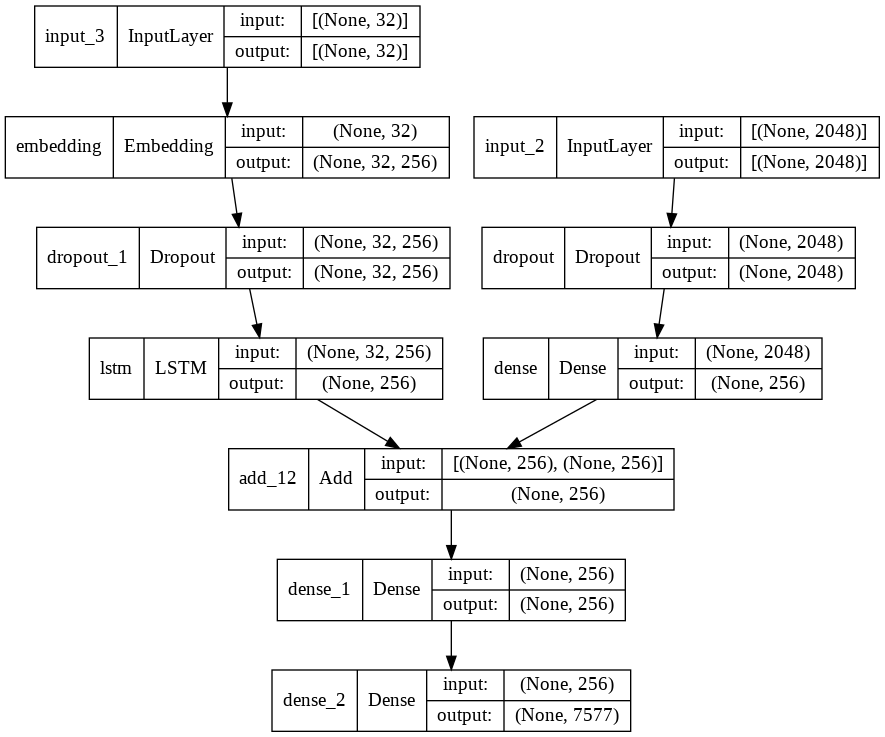

<h1 align="center">Image Captioning Deep learning(Tensorflow and Keras)</h1>

---

 In this project I have used kaggle flicker dataset consisting of images and its descriptions whihc have been used to train the tensorflow/keras deep learning model. 
      

## 📝 The project flow is as following: 

- [Importing Data](#about)
- [Text Cleaning](#getting_started)
- [Text Preprocessing](#deployment)
- [Image Processing](#usage)
- [Defining and training the model for Image captioning](#built_using)
- [Testing the Model](Testing_image.ipynb)

## 🗂 Importing Data 
The dataset has been taken from <a href="https://www.kaggle.com/ming666/flicker8k-dataset"> Kaggle's Flicker8K dataset</a>, which contains images and its follwing text descriptions.

## 🧹 Text Cleaning 
Here I am defining all the functions that I have used to clean the text captions dataset 
- load_doc() : for loading the text file
- all_img_captions : to get all the image with their respective captions
- cleaning_text() : to remove unecessary text like punctuations and numbers and then lowercasing all the text.
- text_vocabulary : build vocabulary using all unique words in the text data
- save_descriptions : to save all descriptions in one file

## 💬 Text processing 
Here I am defining all the functions for text processing of the dataset:
- load_clean_descriptions : to laod all the clean description after text cleaning process
- dict_to_list() : converting dictionary to clean list of descriptions
- create_tokenizer() : creating tokenizer class, this will vectorise text corpus and each integer will represent a token in the dictionary (keras.preprocessing.text.Toeknizer)

##  🏞 Image Processing 

Here I am defining all the functions for text processing of the dataset:
- extract_fetaures() : I used the Xception model of image captioning with average pooling layers to rextrcat features. Processed the image according the model requirements, like resizing, normalisingusing numpy.

## ⛏️ Define models for Image Captioning 

